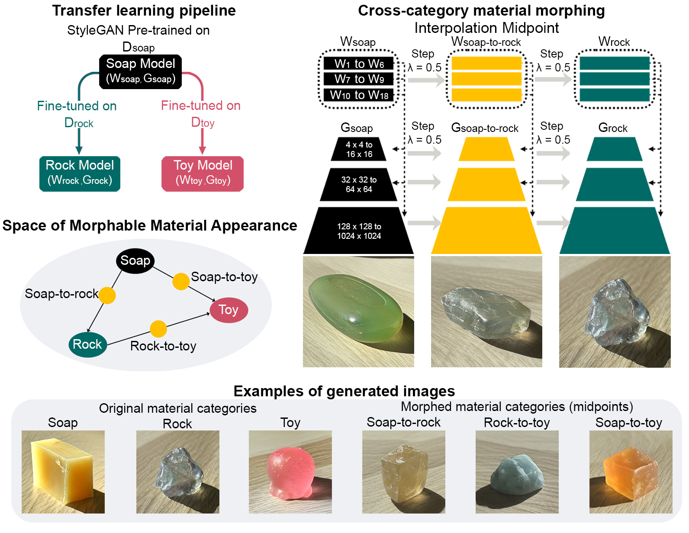

<!-- Improved compatibility of back to top link: See: https://github.com/othneildrew/Best-README-Template/pull/73 -->
<a name="readme-top"></a>

<!-- PROJECT LOGO -->
<br />

<h3 align="center">Material Morphing Toolkit</h3>

  <p align="center">
    Chenxi Liao, Masataka Sawayama, Bei Xiao
  </p>

</div>



We use an unsupervised image synthesis model, StyleGAN2-ADA, to generate images of diverse materials based on the learning of real-world photos. As a result, the model parameterizes the statistical structures of material appearances and facilitates linear interpolation between image data points, allowing us to morph between different material categories. This approach enables us to continuously vary the multidimensional structural features of materials (e.g., the combination of shape and color variation) and build an expanded Space of Morphable Material Appearance.

This Toolkit allows the user the create material morphing sequences for psychophysical experiments. 

<p align="right">(<a href="#readme-top">back to top</a>)</p>

## Preprint
[Liao, C., Sawayama, M., & Xiao, B. (2024). Probing the Link Between Vision and Language in Material Perception. bioRxiv, 2024-01.](https://www.biorxiv.org/content/10.1101/2024.01.25.577219v2)


<!-- GETTING STARTED -->
## Pre-selected Materials
* We provided samples from three material categories: Soap, Rock and Squishy Toys. The images cover two major lightings: Low and Strong indoor lighting. 

* You can find the generated [Materials from W latent sapce](material_latent_code_W).
  - Soap: soap_strong (soap_strong.npy), soap_low (soap_low.npy)
  - Rock: rock_strong (rock_strong.npy), rock_low (rock_low.npy)
  - Squishy toy: toy_strong (toy_low.npy), toy_low (toy_strong.npy)
  
## Cross-material Morphing
* Examples of [material morphing sequences](info_imgs/material_morphing_teaser.png): A 'source' material is gradually transformed into the 'target' material with nine linear interpolation steps. 

* We provide a [notebook](Material_Morphing_Toolkit.ipynb) to create the morphing sequences. 

## Citing

If you found this repository useful, please consider citing:
```bibtex
@article{liao2024probing,
  title={Probing the Link Between Vision and Language in Material Perception},
  author={Liao, Chenxi and Sawayama, Masataka and Xiao, Bei},
  journal={bioRxiv},
  pages={2024--01},
  year={2024},
  publisher={Cold Spring Harbor Laboratory}
}
```
<p align="right">(<a href="#readme-top">back to top</a>)</p>

